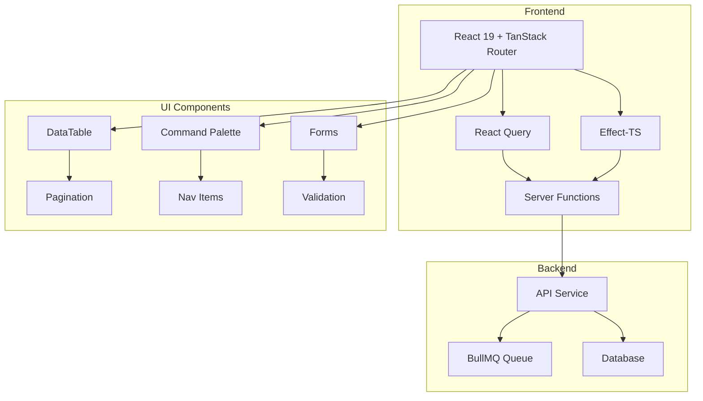

# Analisis Komprehensif Aplikasi Admin Panel

## Ringkasan Eksekutif

Aplikasi admin panel ini adalah sistem manajemen e-commerce yang dibangun dengan teknologi modern (React 19, TanStack Router, Effect-TS) yang menampilkan arsitektur yang solid untuk mengelola produk, pesanan, pelanggan, pengguna, audit log, dan antrian email. Aplikasi ini menunjukkan pemahaman yang baik tentang pola-pola modern pengembangan web, meskipun masih ada beberapa area yang dapat ditingkatkan.

---

## 1. Analisis Antarmuka Pengguna (UI)

### Kekuatan

- **Layout Responsif**: Menggunakan sidebar collapsible dengan desain yang bersih dan modern
- **Komponen Reusable**: DataTable, PaginationBar, dan komponen UI lainnya dibangun dengan pendekatan yang reusable
- **Breadcrumb Navigation**: Implementasi breadcrumb yang dinamis berdasarkan route
- **Command Palette**: Fitur pencarian cepat dengan shortcut ⌘K/Ctrl+K
- **Loading States**: Skeleton loading yang smooth untuk pengalaman pengguna yang lebih baik
- **Dark Mode Ready**: Menggunakan sistem tema yang kompatibel dengan Tailwind CSS

### Kelemahan

- **Konsistensi Styling**: Beberapa komponen menggunakan styling inline yang tidak konsisten (misalnya `SELECT_CLS` di queue dan audit-logs)
- **Aksesibilitas**: Beberapa komponen kurang menyertakan atribut ARIA yang lengkap
- **Mobile Experience**: Sidebar offcanvas mungkin tidak optimal di semua ukuran layar
- **Visual Feedback**: Kurangnya visual feedback untuk aksi penting (misalnya konfirmasi sebelum delete)

### Rekomendasi

1. Buat design system yang konsisten dengan token desain terpusat
2. Tambahkan konfirmasi modal untuk aksi destruktif
3. Implementasikan unit tests untuk komponen UI
4. Tambahkan skeleton loading yang lebih spesifik per halaman

---

## 2. Analisis Pengalaman Pengguna (UX)

### Kekuatan

- **Navigasi Intuitif**: Sidebar dengan ikon yang jelas dan badge notifikasi
- **Filter yang Baik**: Sistem filter yang konsisten di semua halaman list
- **Real-time Updates**: Auto-refresh untuk dashboard (30 detik) dan queue (15 detik)
- **Error Handling**: Error boundary yang user-friendly dengan opsi "Try Again"
- **Session Management**: Redirect otomatis ke login saat sesi habis dengan notifikasi

### Kelemahan

- **Feedback Terbatas**: Toast notifications tidak persisten untuk aksi penting
- **Loading States**: Skeleton loading terlalu generik, tidak mencerminkan struktur konten
- **Keyboard Navigation**: Beberapa komponen mungkin tidak sepenuhnya accessible via keyboard
- **Empty States**: Pesan "No results found" terlalu minimalis

### Rekomendasi

1. Tambahkan empty state illustrations yang lebih engaging
2. Implementasikan undo functionality untuk aksi penting
3. Tambahkan progress indicators untuk operasi yang memakan waktu
4. Buat panduan singkat untuk fitur-fitur utama

---

## 3. Analisis Kinerja (Performance)

### Kekuatan

- **Code Splitting**: Menggunakan TanStack Router dengan lazy loading
- **React Query**: Stale time 60 detik mengurangi request berlebih
- **Preloading**: `defaultPreload: "intent"` untuk prefetching route
- **Suspense**: React Suspense untuk loading states
- **Image Optimization**: Lazy loading untuk gambar produk

### Kelemahan

- **Bundle Size**: TanStack Query Devtools mungkin tidak perlu di production
- **Memory Leaks**: Beberapa event listener mungkin tidak dibersihkan dengan sempurna
- **Cache Strategy**: Stale time tetap mungkin tidak optimal untuk semua use case
- **Bundle Analysis**: Tidak ada analisis bundle size yang terlihat

### Rekomendasi

1. Implementasikan code splitting lebih agresif untuk route yang jarang diakses
2. Tambahkan virtual scrolling untuk tabel dengan banyak data
3. Optimalkan gambar dengan format modern (WebP/AVIF)
4. Implementasikan service worker untuk caching offline

---

## 4. Analisis Keamanan (Security)

### Kekuatan

- **Role-Based Access Control (RBAC)**: Sistem permission yang granular (OWNER, ADMIN, FINANCE)
- **Typed Errors**: Error handling dengan Effect-TS yang type-safe
- **Input Validation**: Schema validation dengan Valibot di semua form
- **Cookie Forwarding**: Implementasi yang aman untuk session cookies
- **401 Handling**: Auto-refresh token dengan cooldown mechanism

### Kelemahan

- **Rate Limiting**: Tidak terlihat implementasi rate limiting di frontend
- **XSS Protection**: Tidak jelas apakah ada sanitasi input untuk konten rich text
- **CSRF Protection**: Bergantung pada cookie-based auth tanpa token CSRF eksplisit
- **Audit Trail**: Audit log hanya mencatat aksi admin, tidak mencatat akses data

### Rekomendasi

1. Tambahkan Content Security Policy (CSP) headers
2. Implementasikan input sanitization untuk field deskripsi
3. Tambahkan logging untuk aktivitas mencurigakan
4. Pertimbangkan implementasi 2FA untuk role OWNER

---

## 5. Analisis Fitur (Features)

### Fitur yang Ada

| Modul         | Status | Keterangan                                       |
| ------------- | ------ | ------------------------------------------------ |
| Dashboard     | ✅     | Statistik real-time, recent orders, top products |
| Products      | ✅     | CRUD lengkap, image display, status management   |
| Orders        | ✅     | List, filter, export, status update              |
| Customers     | ✅     | List, detail, role management, delete/restore    |
| Users (Staff) | ✅     | Invite, role management, deactivate/restore      |
| Audit Logs    | ✅     | Filter by date, action, role                     |
| Email Queue   | ✅     | Failed jobs, retry, resend                       |
| Settings      | ✅     | Store configuration                              |

### Kekuatan

- **Feature Completeness**: Hampir semua fitur CRUD untuk entitas bisnis utama
- **Export Functionality**: Export orders ke format text
- **Real-time Monitoring**: Queue monitoring dengan auto-refresh
- **Soft Delete**: Implementasi soft delete untuk data penting

### Kelemahan

- **Search**: Pencarian global terbatas (hanya di command palette)
- **Bulk Actions**: Tidak ada operasi bulk untuk data
- **Import**: Tidak ada fitur import data
- **Reporting**: Tidak ada laporan dalam format PDF/Excel
- **Notification**: Tidak ada sistem notifikasi real-time

### Rekomendasi

1. Tambahkan bulk actions untuk products dan orders
2. Implementasikan import/export CSV untuk data
3. Tambahkan fitur reporting dengan chart visualization
4. Buat sistem notifikasi untuk event penting (stok rendah, order baru)

---

## 6. Analisis Kemudahan Penggunaan (Usability)

### Kekuatan

- **Bahasa Indonesia**: UI menggunakan bahasa Indonesia yang konsisten
- **Form Validation**: Error messages yang jelas dan kontekstual
- **Keyboard Shortcuts**: ⌘K untuk command palette
- **Responsive Design**: Layout yang responsive untuk berbagai ukuran layar

### Kelemahan

- **Onboarding**: Tidak ada panduan untuk pengguna baru
- **Tooltips**: Kurangnya tooltips untuk ikon dan aksi
- **Consistency**: Beberapa halaman memiliki layout yang berbeda
- **Help System**: Tidak ada sistem bantuan terintegrasi

### Rekomendasi

1. Tambahkan tooltips untuk semua ikon aksi
2. Buat dokumentasi singkat untuk setiap modul
3. Implementasikan tour guide untuk pengguna baru
4. Tambahkan keyboard shortcuts untuk aksi umum

---

## 7. Arsitektur & Kualitas Kode

### Kekuatan

- **Effect-TS**: Penggunaan Effect-TS untuk error handling yang type-safe
- **Server Functions**: Penggunaan TanStack Start server functions
- **Separation of Concerns**: File terorganisir dengan baik (components, server, effect, lib)
- **Type Safety**: Penggunaan TypeScript dan Valibot untuk validasi runtime

### Kelemahan

- **Circular Dependencies**: Risiko circular dependency di `useNavItems.tsx`
- **Code Duplication**: Beberapa komponen memiliki styling yang duplikat
- **Testing**: Tidak terlihat test coverage yang tinggi
- **Documentation**: Komentar kode ada tapi tidak konsisten

### Rekomendasi

1. Tambahkan unit tests untuk business logic
2. Implementasikan E2E tests untuk alur kritis
3. Buat dokumentasi API untuk setiap server function
4. Pertimbangkan refactoring untuk mengurangi duplikasi kode

---

## 8. Rekomendasi Prioritas

### Prioritas Tinggi (P1)

1. **Aksesibilitas**: Tambahkan ARIA labels dan improve keyboard navigation
2. **Error Handling**: Perbaiki error boundary untuk menampilkan error details di development
3. **Security**: Tambahkan CSP headers dan input sanitization
4. **Performance**: Implementasikan virtual scrolling untuk tabel besar

### Prioritas Menengah (P2)

1. **UX Improvements**: Tambahkan empty state illustrations
2. **Bulk Actions**: Implementasikan operasi bulk untuk data
3. **Search Enhancement**: Tambahkan pencarian global yang lebih baik
4. **Testing**: Tambahkan unit tests untuk komponen kritis

### Prioritas Rendah (P3)

1. **Import/Export**: Fitur import data dari CSV
2. **Reporting**: Laporan dalam format PDF
3. **Onboarding**: Tour guide untuk pengguna baru
4. **Advanced Features**: Notifikasi real-time, 2FA

---

## 9. Diagram Arsitektur

---

## 10. Kesimpulan

Aplikasi admin panel ini menunjukkan kualitas kode yang baik dengan arsitektur modern dan fitur yang lengkap untuk kebutuhan manajemen e-commerce. Kekuatan utamanya terletak pada:

1. **Arsitektur yang Solid**: Penggunaan Effect-TS, TanStack Router, dan React Query
2. **RBAC yang Baik**: Sistem permission yang granular dan terimplementasi dengan baik
3. **Error Handling**: Typed errors yang konsisten dan user-friendly
4. **Performance**: Preloading, caching, dan code splitting yang sudah diterapkan

Area yang perlu perhatian lebih lanjut adalah aksesibilitas, pengalaman mobile, dan penambahan fitur bulk operations. Dengan implementasi rekomendasi prioritas tinggi, aplikasi ini dapat meningkatkan kepuasan pengguna secara signifikan.

### Skor Keseluruhan: 8.2/10

| Kategori    | Skor | Keterangan                                            |
| ----------- | ---- | ----------------------------------------------------- |
| UI/UX       | 8.0  | Desain modern, perlu improvement aksesibilitas        |
| Performance | 8.5  | Optimasi baik, bisa lebih baik dengan virtual scroll  |
| Security    | 7.5  | RBAC solid, perlu penambahan CSP & input sanitization |
| Features    | 8.5  | Lengkap untuk kebutuhan dasar, perlu bulk operations  |
| Usability   | 8.0  | Bahasa lokal, perlu onboarding & tooltips             |
